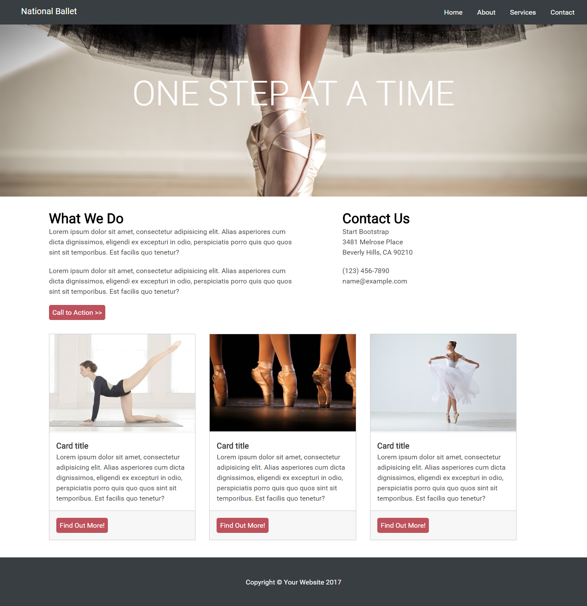
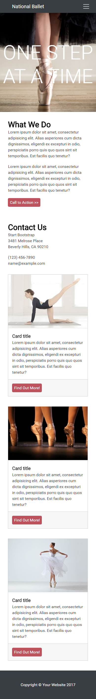

# Reto de Código - Mi Página

* **Track:** _Common Core_
* **Curso:** _Crea tu propia red social_
* **Unidad:** _La web desde un móvil_

***

## Objetivo

Este reto consiste en realizar una página, para ello se utilizará una estructura específica dada por Laboratoria y un sistema de rejillas (grid).

## Especificaciones

* Se presentan dos vistas: desktop y mobile. La vista desktop inicia a partir de min-width: 768px.
* El archivo index.html contiene la estructura de la página, y se enlaza con dos archivos: main.css y grid.css.
* En la carpeta “css” se almacenan dos archivos: main.css usado para dar estilo y diseño a la página, y grid.css usado para el sistema de rejilla (grid).
* En la carpeta “assets” se almacenan las imágenes utilizadas en el archivo html (images) y en el Readme.md (docs).
* Esta página utiliza la tipografía Roboto.
* La paleta de colores son los siguientes: #d0d0d0, #383e42, #393939, #cccccc, #f7f7f7, #bd515c.

La estructura de la página es la siguiente:

### Vista desktop:

### Vista mobile:

